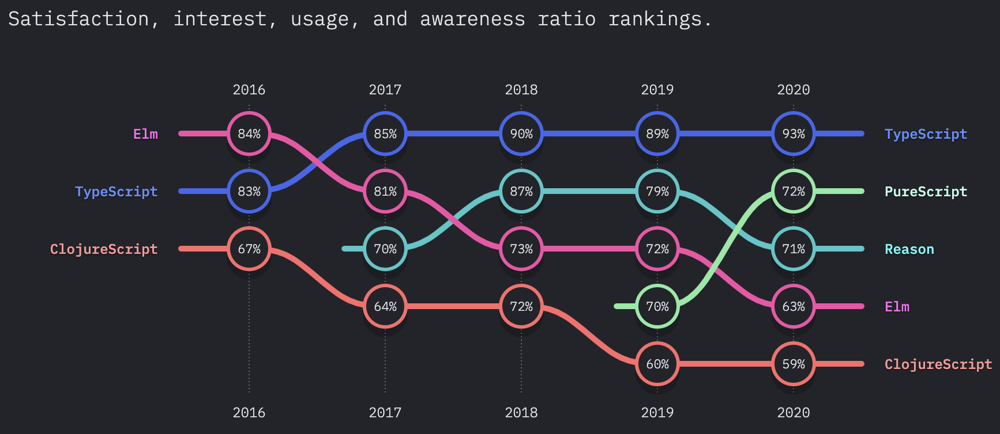
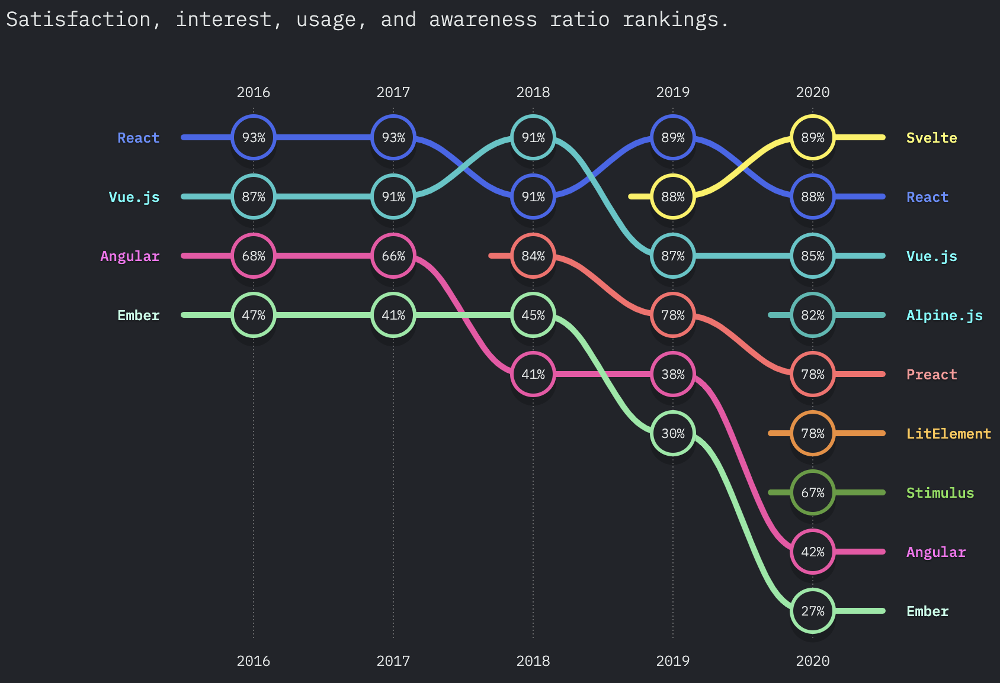

# State of JS 2020: Typescript and Svelte

A few days ago, ["State of JS 2020"](https://2020.stateofjs.com/es-ES/) survey was released, a famous survey that every year retrieves information about the current state of Javascript in the world.

In this survey we can find a lot of categories such as Frontend Frameworks, Backend Frameworks, Testing Tools, Flavours of Javascript, and many others. Nowadays, Javascript libraries ecosystem is very huge, and some of them increase its popularity and usage as other ones decrease them. Today, we'll talk specifically about two that caught my attention: Typescript and Svelte.

These technologies had the highest percentage of satisfaction on their categories (JS Flavours and Frontend Frameworks, respectively). And Svelte was the greatest surprise because it reached the first place, even over React.

**JS Flavours**


**Frontend Frameworks**


## Typescript

Typescript is a superset of JS, it means it has all JS features but it includes some other ones. The main one is static typing.

```javascript
// JS - without typing
const age = 23;
const name = 'Fer';
const isAdmin = true;
```

```typescript
// TS - with typing
const age: number = 23;
const name: string = 'Fer';
const isAdmin: boolean = true;
```

If you don't have a long time programming or if you haven't been on a large project, you will probably think that it isn't worth adding that complexity to code. And I understand, I got away from Java 'cause I didn't like its so strict and verbose syntax, but after a while, the advantages of static typing can be pretty good.

I recommend taking a look at its [official page](https://www.typescriptlang.org/) and giving it a try. I'm sure you won't regret it 😉.

## Svelte

Svelte is the new guy, the most recent of frontend frameworks (I know, another one to learn about it 🙄)


But before you run out, let me tell you that Svelte comes with a very attractive proposal. Among the 4 main options (Angular, React, Vue, Svelte), the latter is which most resembles to vanilla JS. Check the following example:

```html
<script>
  // Reactive variable
  let name = 'Fer';

  // Reactive method
  const changeName = () => name = 'Pedro';
</script>

<style>
p {
  color: red;
}
</style>

<p>Hello {name}</p>

<button on:click={changeName}>Change name</button>
```

As you can see, we simply declare a variable, and it automatically turns in a reactive variable (in fact, Svelte is as intelligent as it can determinate which variables must be reactive and which must not, but those are technical details for other post). And to declare reactive methods, it's as simple as declaring a function. Everything within a `<script>` tag.

In case you want to add some styles, you need to put them within a `<style>` tag and you don't have to worry about writing super weird class names to avoid collisions. Svelte isolates every component styles.
Finally, anything else apart from JS or CSS, can be written below without any special treatment. A piece of cake, it isn't?

If you got shocked, I recommend getting dig into its [documentation](https://svelte.dev/) 👁.

::: tip
By the way, my personal website [fergv.com](https://fergv.com) is built with Svelte and [Sapper](https://sapper.svelte.dev/) (the Svelte's framework). This is the [repo's link](https://github.com/FerGv/FerGv.github.io) if you want to review in detail.
:::

Well, that's it for today, I hope you have enjoyed the post. See you in the next article.

Happy coding! 🥸

<Disqus />
