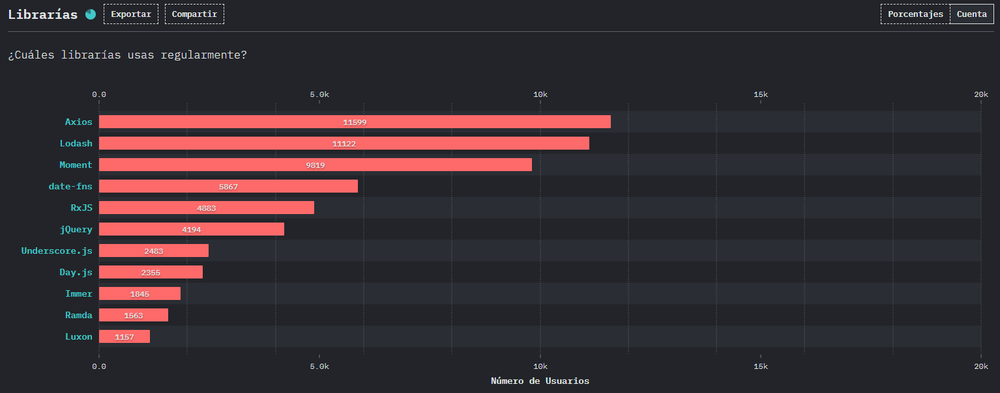
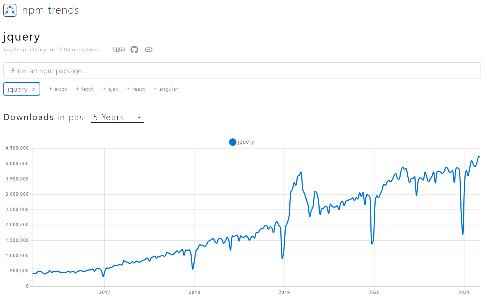

# jQuery

Hoy hablaremos del rey de las librerías de Javascript, el amado y odiado [jQuery](https://jquery.com/) 👑. Estoy seguro que ya habrás escuchado de él, ya que a pesar de que en los últimos años ha caído su uso, aún en pleno 2021 sigue siendo una de las librerías más usadas.

De hecho, según la encuesta ["State of JS 2020"](https://2020.stateofjs.com), jQuery está en el top 10 de librerías más usadas.

Y revisando la tendencia en [npm trends](https://www.npmtrends.com/jquery) me sorprendió que es positiva 🤯.

Así que veamos algunos conceptos básicos que te pueden servir si algún día requieres usar esta librería.

## Conclusión

Si estás creando proyectos nuevos, te recomiendo **ya no usar jQuery**. No es una librería mala pero muchas cosas ya se pueden hacer con JS vainilla (nativo) gracias a las [nuevas características de ECMAScript2015](../es6-features/).

Además, usando frameworks frontend como [Angular](https://angular.io/), [React](https://es.reactjs.org/), [Vue](https://vuejs.org/) o [Svelte](https://svelte.dev/) se pueden crear aplicaciones aplicando la programación reactiva de una manera muy elegante. **Olvídate de actualizar el DOM manualmente y enfócate en la lógica del negocio**.

Happy coding! 🥸

<Disqus />
