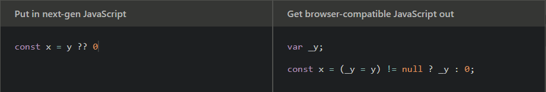

# Babel

[Babel](https://babeljs.io/) es una herramienta de Javascript que nos permite transpilar el código de versiones modernas del lenguaje a código que cualquier plataforma (navegador/[Node](https://nodejs.org/es/)) pueda entender. Te muestro un ejemplo sacado de la documentación oficial:



> De lado izquierdo es el código de ECMAScript2020 usando el [nullish coalescing operator ](https://developer.mozilla.org/en-US/docs/Web/JavaScript/Reference/Operators/Nullish_coalescing_operator) y de lado derecho el código transpilado por Babel.

Aunque el código generado no es tan legible para humanos, la verdad es que no interesa porque ese código es para el intérprete, no para nosotros. Babel nos da la oportunidad de escribir código legible y él se encargará de generar el código que sea necesario para que corra donde sea.

Hoy te mostraré una pequeña configuración que utilizó para mis proyectos backend en Node. Para el frontend te recomiendo usar algún framework como [Vue](https://vuejs.org/), [React](https://es.reactjs.org/) o [Svelte](https://svelte.dev/), ellos ya se encargan de la configuración por ti.

::: tip
Usé la palabra **"transpilar"** porque a pesar de que se hace una compilación de código, la diferencia es que la transformación se aplica entre lenguajes de similar nivel de abstracción (en este caso versiones diferentes de JS). Si conoces [Typescript](https://www.typescriptlang.org/), podríamos decir que también **transpila** el código porque sigue siendo JS. Por el contrario, el código de Java se **compila** a lenguaje máquina.

Te dejo unos links que espero despejen tus dudas:

- [Transpilador](https://es.wikipedia.org/wiki/Transpilador)
- [¿Cuáles son las diferencias entre compilar y transpilar?](https://es.quora.com/Cu%C3%A1les-son-las-diferencias-entre-compilar-y-transpilar)

:::

## Requerimientos

- [Node](https://nodejs.org/es/) (versión 12+)
- npm (versión 6+)

> `npm` se instala junto con Node.

## Creación del proyecto

1. Crea una carpeta para el proyecto y entra en ella.

```sh
$ mkdir babel-prueba
$ cd babel-prueba
```

> Si te quieres ver pro, puedes ejecutar `mkdir babel-prueba && cd $_`. Solo funciona en UNIX.

::: tip
Puedes abrir este proyecto en tu editor de código preferido. En lo personal, yo uso [Visual Studio Code](https://code.visualstudio.com/).
:::

1. Inicia un proyecto con **npm**.

```sh
$ npm init -y
```

> `-y` nos evita ingresar manualmente la configuración y utiliza todos los valores por defecto.

## Instalación

Necesitamos 3 librerías base de Babel:

- [@babel/core](https://www.npmjs.com/package/@babel/core)

  Funcionalidad base de Babel

- [@babel/cli](https://www.npmjs.com/package/@babel/cli)

  Interfaz de comandos de Babel

- [@babel/preset-env](https://www.npmjs.com/package/@babel/preset-env)

  Los [presets](https://babeljs.io/docs/en/presets/) de Babel ayudan a agregar funcionalidad a la base de Babel. Este preset ayuda a compilar código de ES2015

```sh
# Puedes usar -D como atajo para --save-dev
# Puedes usar `i` como atajo para `install`
$ npm i -D @babel/core @babel/cli @babel/preset-env
```

Las instalamos como dependencias de desarrollo porque son necesarias para generar el código de producción pero no para que funcione.

## Uso

Ahora crearemos una carpeta `src` en la que guardaremos todo el código de la aplicación.

```sh
$ mkdir src
$ cd src
```

Y dentro crearemos un archivo `index.js` con el siguiente contenido:

```js
// src/index.js
console.log('Hola Mundo');
```

Para que Babel compile nuestros archivos, necesitaremos crear un archivo `babel.config.json` en la raíz del proyecto (fuera de `src`) y agregar un script en el `package.json`.

```json
// babel.config.json
{
  "presets": ["@babel/env"]
}
```

```json
// package.json
{
  ...
  "scripts": {
    "build": "babel src --out-dir dist"
  }
  ...
}
```

En el primer archivo le estamos indicando a Babel que queremos que use un **preset** adicional para que entienda la sintaxis de ES6+. En el `build` le indicamos que `src` es la única carpeta que queremos que compile y que el resultado lo guarde en un directorio `dist`.

Ahora nos movemos a la ruta donde esté el `package.json` para ejecutar el comando para la compilación:

```sh
# En caso de que estuvieramos en `src`, subimos un directorio.
$ cd ..
$ npm run build
```

Cuando termine la ejecución de este comando, verás que se crea un nuevo directorio `dist` y dentro un archivo `index.js` con este contenido:

```js
// dist/index.js
'use strict';

console.log('Hola Mundo');
```

Hasta aquí no se ve realmente un cambio significativo, solo le agregó una línea al código original 🙃. Pero es porque el `console.log` está más que soportado por todas las plataformas.

::: tip
Si quieres saber más del modo estricto, hablé sobre él en mi artículo de ["Buenas prácticas"](../best-practices/#modo-estricto).
:::

Pero agreguemos algo interesante en nuestro `src/index.js` para que veamos el poder de Babel. Crearemos una pequeña app con [Express](https://expressjs.com/es/), así que primero instalemos la librería:

```sh
# Se agregará como dependencia de producción.
$ npm i express
```

Y copia este código en tu index. Sin entrar en tanto detalle, se levanta un pequeño servidor que escuchará las peticiones en el puerto 3000, y cuando entres a `http://localhost:3000` te responderá con un "Hola Mundo".

```js
// src/index.js
import express from 'express';

const main = async () => {
  const app = express();

  app.get('/', (req, res) => {
    res.send('Hola Mundo');
  });

  await app.listen(3000);
  console.log('Servidor escuchando en http://localhost:3000');
};

main();
```

::: danger
Siempre modifica los archivos de `src`, nunca los de `dist` ya que estos últimos serán sobreescritos en cada compilación.
:::

Ejecuta `npm run build` para compilar los nuevos archivos. Si ahora revisas el `dist/index.js`, verás un código muy raro y difícil de entender, pero es la versión del código que cualquier plataforma (navegador/Node) puede entender. Para correr el programa, simplemente ejecuta:

```sh
$ node dist/index.js
```

::: warning
Si al correr el programa obtienes el siguiente error, sigue estos pasos para solucionarlo:

**ReferenceError: regeneratorRuntime is not defined**

1. Instala el plugin de Babel [@babel/plugin-transform-runtime](https://babeljs.io/docs/en/babel-plugin-transform-runtime).

```sh
$ npm i -D @babel/plugin-transform-runtime
```

2. Agrega el plugin en el archivo de configuración de Babel.

```json
{
  "presets": ["@babel/env"],
  "plugins": ["@babel/plugin-transform-runtime"]
}
```

3. Vuelve a compilar el proyecto.

```sh
$ npm run build
```

Después de esto ya no deberías tener ningún problema 😉.
:::

## Aliases (Bonus)

Hasta aquí ya puedes trabajar sin ningún problema en tu proyecto con JS moderno, pero te daré un tip que lo tomé de los proyectos de Vue y es el uso de **aliases**. En realidad, es una configuración de [Webpack](https://webpack.js.org/) que viene por defecto cuando creas un proyecto con la [Vue CLI](https://cli.vuejs.org/) pero en este caso lo haremos con Babel.

1. Primero debemos instalar un plugin de Babel llamado [babel-plugin-module-resolver](https://www.npmjs.com/package/babel-plugin-module-resolver) (como dependencia de desarrollo):

```sh
$ npm i -D babel-plugin-module-resolver
```

2. Modificamos el `babel.config.json` para agregar la configuración del plugin:

```json
// babel.config.json
{
  "plugins": [
    // otros plugins
    [
      "module-resolver",
      {
        "root": ["."],
        "alias": {
          "@": "./src/"
        }
      }
    ]
  ]
}
```

3. Si estás en [VSCode](https://code.visualstudio.com/), agrega un archivo `jsconfig.json` en la raíz del proyecto.

```json
// jsconfig.json
{
  "compilerOptions": {
    "baseUrl": ".",
    "paths": {
      "@/*": ["./src/*"]
    }
  }
}
```

Supongamos que tienes la siguiente estructura en tu proyecto:

```
babel-prueba
|- babel.config.json
|- jsconfig.json
|- package.json
|- src/
   |- index.js
   |- modelos/
      |- carro-compras/
         |- Item.js
   |- servicios/
      |- carro-compras/
         |- item.js
```

Ahora dentro de `servicios/item.js` puedes importar el modelo `Item` de esta forma:

```js
import Item from '@/modelos/carro-compras/Item';
```

Y evitar el uso de las rutas relativas usando los puntos `../../`:

```js
import Item from '../../modelos/carro-compras/Item';
```

Con esta configuración ahora podrás importar desde cualquier archivo de una manera más fácil y obtener ayudas del [intellisense de VSCode](https://code.visualstudio.com/docs/editor/intellisense). También evitas tener que modificar tus importaciones si mueves tu archivo a un lugar diferente dentro de la estructura de tu proyecto.

## Conclusión

Espero te haya gustado esta útil herramienta del ecosistema de Javascript, te recomiendo que comiences a usarla para que siempre puedas aplicar las nuevas características del lenguaje sin tener que preocuparte por si el código será soportado por navegadores viejos o versiones antiguas de Node.

Happy coding! 🥸

<Disqus />
