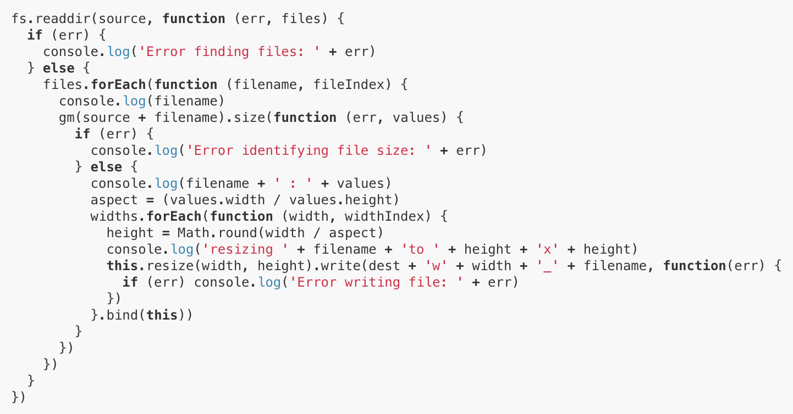

# Infierno de Callbacks (Promesas y async/await)

En los tiempos oscuros de Javascript, el asíncronismo era la pesadilla de muchos desarrolladores debido a lo que se conocía como el **Callback Hell (Infierno de Callbacks)**.

<p style="text-align: center">
  
</p>

> Muchos todavía no pueden dormir tranquilos 🤯.

Pero ¿cómo lucía?, ¿qué era?, ¿qué lo hacía tan espantoso?. Bueno, una imagen dice más que mil palabras:

<p style="text-align: center">
  
</p>

::: tip
De hecho, es tan famoso que descubrí que tiene una [página](http://callbackhell.com/) 😯.
:::

Como puedes observar, el código de arriba está imposible de entender a simple vista, y mucho menos para alguien que va comenzando en JS (yo ya llevo tiempo en esto y aún así me da miedo 😂).

El asincronismo en JS se basa en [callbacks](https://developer.mozilla.org/es/docs/Glossary/Callback_function), que son **funciones pasadas como argumentos a otras funciones para que sean ejecutadas en algún momento dentro de la ejecución de la función principal**. Suena más complicado de lo que realmente es, además las encuentras por todos lados:

```js
// Agregar un evento a un botón.
const boton = document.querySelector('#boton');
boton.addEventListener('click', () => alert('Presionaste el botón'));

// Poner un timer.
setTimeout(() => alert('Pasaron 5 segundos'), 5000);

// En métodos de arreglos.
const superheroes = ['Iron Man', 'Capitán América', 'Thor'];
superheroes.forEach((superheroe) => console.log(superheroe));
```

Practicamente a donde mires, encontrarás un callback. Esto no quiere decir que sean malos, el problema es que fácilmente se pueden salir de control conforme comienza a crecer el proyecto y comienzas a realizar cosas más complejas como llamadas a APIs.

Así que veamos un ejemplo común y llevémoslo de **callbacks** a **promesas** a **async/await**. Estos dos últimos son la forma moderna de lidiar con la asincronía.

## [Callbacks](https://developer.mozilla.org/es/docs/Glossary/Callback_function)

Como te mencione arriba, los callbacks son **funciones pasadas como argumentos a otras funciones para que sean ejecutadas en algún momento dentro de la ejecución de la función principal**. Entonces, si queremos traer los datos de un sitio web externo como [Dog API](https://dog.ceo/dog-api/) (tienen imágenes super cool 🐶), debemos crear una función que maneje esa información en el momento en que la obtengamos (que realmente no sabemos con exactitud cuándo es).

> La URL de la API es [https://dog.ceo/api/breeds/image/random](https://dog.ceo/api/breeds/image/random), pero me referiré a ella como API_URL en el código.

```js
const request = new XMLHttpRequest();
request.addEventListener('readystatechange', function() {
  // Verificamos si la petición fue exitosa
  if (this.readyState == 4 && this.status == 200) {
    console.log(JSON.parse(request.responseText));
  } else {
    console.log('Ocurrió un error');
  }
});
request.open('GET', API_URL);
request.send();
```

¿Confundid@? No te preocupes. Usamos [XMLHttpRequest](https://developer.mozilla.org/es/docs/Web/API/XMLHttpRequest/Using_XMLHttpRequest) que era la antigua manera de realizar peticiones para demostrar el uso de callbacks. Pero ahora tenemos mejores formas de hacer esto.

## [Promesas](https://developer.mozilla.org/es/docs/Web/JavaScript/Reference/Global_Objects/Promise)

Las promesas son la nueva forma de realizar acciones asíncronas dentro de JS. Comencemos analizando cómo crear una:

```js
new Promise((resolve, reject) => {
  try {
    resolve('La promesa fue exitosa');
  } catch (error) {
    reject(error);
  }
});
```

Recibe una función con dos parámetros **(resolve, reject)** las cuales son funciones que se ejecutarán en caso de éxito o error, respectivamente. Puedes pasarle un argumento a estas funciones, el cual podrás usar más adelante.

Usamos el método `then` para realizar alguna acción cuando una promesa se resuelve satisfactoriamente. En caso contrario, usamos `catch` para recibir el error y realizar el manejo correspondiente.

```js
miPromesa()
  .then((value) => console.log(`La promesa fue exitosa y retornó ${value}`))
  .catch((error) => console.log(`La promesa falló por ${error}`));
```

Para transformar nuestro ejemplo, ahora usaremos [fetch](https://developer.mozilla.org/es/docs/Web/API/Fetch_API/Using_Fetch), una nueva API del navegador para realizar peticiones HTTP que utiliza promesas. La sintaxis mejora muchísimo, ya no duele leer esto.

```js
fetch(API_URL)
  // Recibimos la respuesta y retornamos una promesa que la convierta en JSON.
  .then((res) => res.json())
  // Encadenamos otro `then` para recibir el valor de la nueva promesa.
  .then((json) => console.log(json))
  // `catch` recibirà el primer error que se lance en cualquier promesa.
  .catch((error) => console.log(`Ocurrió un error: ${error}`));
```

::: tip
Podemos encadenar tantas promesas como queramos, simplemente agregando un método `then` para cada una. El método `catch` no necesita duplicarse, cachará cualquier error que surja en las promesas.
:::

::: tip
Puedes convertir una función que usa callbacks, a una que retorne una Promesa, con el siguiente truco. Veamos un ejemplo real:

```js
function cargarArchivoCallback(file, callback) {
  const reader = new FileReader();
  reader.addEventListener('load', callback);
  reader.readAsDataURL(file);
}

function cargarArchivoPromesa(file) {
  return new Promise((resolve, reject) => {
    try {
      // Aquí metes toda la lógica que necesites y al finalizar
      // llamas a la función `resolve` en lugar del callback.
      const reader = new FileReader();
      reader.addEventListener('load', resolve);
      reader.readAsDataURL(file);
    } catch (error) {
      reject(error);
    }
  });
}

cargarArchivoCallback(file, (event) => {
  img.src = event.target.result;
});

cargarArchivoPromesa(file).then((event) => {
  img.src = event.target.result;
});
```

Este ejemplo carga una imagen a través del [FileReader](https://developer.mozilla.org/es/docs/Web/API/FileReader) y cuando completa la carga, actualiza el atributo `src` de un elemento `img`. Tal vez parezca más enredado el uso de promesas pero al consumir la función podríamos encadenar una nueva promesa o utilizar async/await y el código sería mucho más legible.
:::

## [Async/await](https://developer.mozilla.org/es/docs/Web/JavaScript/Reference/Statements/async_function)

Finalmente, la forma más moderna de trabajar con la asincronía es **async/await**. La sintaxis es tan clara que casi no necesita explicación:

```js
async function miFuncionAsync() {
  try {
    const resultado = await miPromesa();
  } catch (error) {
    console.log(error);
  }
}
```

La clave está en que usamos **await** para detener la ejecución del programa en ese punto y esperar a que la promesa se resuelva. En caso exitoso, retornará el valor y lo guardará en una variable. En caso fallido, lanzará una excepción con el error. Por eso usamos el **try/catch**.

La única condición para usar **await** es que debe estar dentro de una función declarada con la palabara **async**. La palabra **async** indica que esa función retorna una promesa. Así que si, seguimos usando promesas pero con una sintaxis más amigable, al estilo síncrono.

Y nuestro ejemplo quedaría así:

```js
async function getPerrito() {
  try {
    // Esperamos que la promesa resuelva y guardamos el valor en una constante.
    const res = await fetch(API_URL);
    // Esperamos la siguiente promesa y guardamos su valor.
    const json = await res.json();
    console.log(json);
  } catch (error) {
    // `catch` recibirà el primer error que se lance durante la ejecución del `try`.
    console.log(`Ocurrió un error: ${error}`);
  }
}

getPerrito();
```

## Conclusión

En lo personal trató de usar **async/await** para casi todo porque el código queda más limpio y claro. Además, se lee como si fuera síncrono, una forma de programar con la que la mayoría estamos más acostumbrados. Pero queda a tu consideración cuál usar, solo analiza bien el caso de uso de cada uno.

Hasta la próxima. Happy coding! 🥸

<Disqus />
