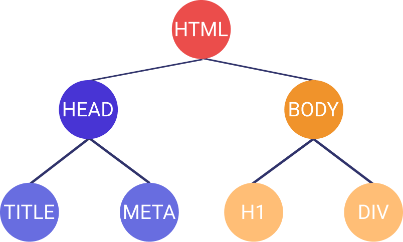
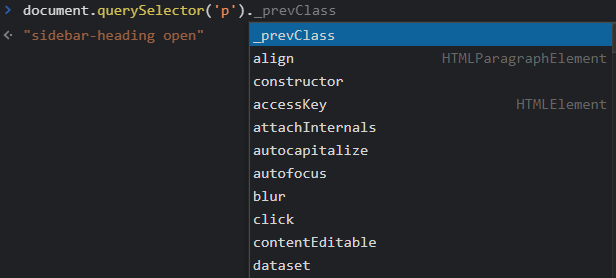

# DOM (Manipulando HTML con JS)

El [DOM](https://developer.mozilla.org/es/docs/Web/API/Document_Object_Model/Introduction) es una [API](https://developer.mozilla.org/es/docs/Glossary/API) del navegador que nos permite manipular nuestro documento HTML a través del mapeo de todos sus datos. Por mapear me refiero a armar una [estructura de árbol jerárquico](<https://es.wikipedia.org/wiki/%C3%81rbol_(inform%C3%A1tica)>) en donde cada elemento HTML se representa como un nodo.

<p style="text-align: center">
  
</p>

<p style="text-align: center">
  
</p>

> El **DOM** también nos permite manipular XML 🤯.

## Obtener elementos

Tradicionalmente tenemos métodos para obtener elementos por:

- **ID ([getElementById](https://developer.mozilla.org/es/docs/Web/API/Document/getElementById))**
- **Clase ([getElementsByClassName](https://developer.mozilla.org/es/docs/Web/API/Document/getElementsByClassName))**
- **Atributo "name" para inputs de un formulario ([getElementsByName](https://developer.mozilla.org/es/docs/Web/API/Document/getElementsByName))**
- **Etiqueta ([getElementsByTagName](https://developer.mozilla.org/es/docs/Web/API/Document/getElementsByTagName))**

Y la manera de usarlos es siempre invocando al objeto [`document`](https://developer.mozilla.org/es/docs/Web/API/Document), el cual nos permite acceder a todas las funcionalidades del DOM:

```js
document.getElementById('un-identificador');
document.getElementsByClassName('una-clase');
document.getElementsByName('un-input');
document.getElementsByTagName('div');
```

Pero ahora tenemos dos nuevos métodos que nos permiten utilizar todo el poder de los [selectores CSS](https://developer.mozilla.org/es/docs/Learn/CSS/Building_blocks/Selectors) en los cuales nos enfocaremos hoy:

### [querySelector](https://developer.mozilla.org/en-US/docs/Web/API/Document/querySelector)

Este método nos permite obtener el primer elemento que coincida con el selector pasado como argumento. El selector puede ser tan simple o tan complejo como sea necesario. Así podemos replicar la misma funcionalidad de los métodos anteriores y extenderla.

```js
// Obtener por ID
document.querySelector('#mi-identificador');

// Obtener por Clase
document.querySelector('.mi-clase');

// Obtener por Atributo "name"
document.querySelector('[name="mi-input"]');

// Obtener por Etiqueta
document.querySelector('div');

// Combinando selectores
// Busca un elemento con el ID "contenedor", después busca el primer elemento div
// y dentro un elemento con la clase "link"
document.querySelector('#contenedor > div .link');
```

<!-- TODO: add explanation about using querySelector on an element -->
No solo podemos usar `querySelector` en el objeto `document`, si ya previamente obtuvimos un elemento, podemos usarlo como nuestro nodo raíz (el nodo a partir del cual comienza la estructura de árbol) y buscar en él.

```js
const contenedor = document.querySelector('#contenedor');
const imagenContenedor = contenedor.querySelector('img');
```

Como puedes ver, la primera llamada de `querySelector` se realiza sobre `document` pero la segunda ya no. En este sentido, la búsqueda de la imagen no se hace en todo el documento, solo en los elementos hijos del nodo `#contenedor`.

### [querySelectorAll](https://developer.mozilla.org/en-US/docs/Web/API/Document/querySelectorAll)

Este método es prácticamente igual que el anterior, la única diferencia es que retornará un "arreglo" de nodos llamado [NodeList](https://developer.mozilla.org/es/docs/Web/API/NodeList).

```js
// Obtener todos los elementos con la clase "link"
document.querySelectorAll('.link');
```

::: warning
Un objeto `NodeList` no es un arreglo como tal, por lo que no podrás usar métodos como `map` o `reduce`. El único permitido es `forEach`.
:::

## Manipular elementos

Pero obtener elementos no sirve de nada si no se hace algo con ellos. Así que veamos cómo manipularlos y realmente sacarles provecho.

### Detalle

Lo más sencillo es obtener información acerca de los elementos. Esto es tan simple como imprimir en consola.

```js
const titulo = document.querySelector('title');
console.log(titulo);
// -> <title>DOM (Manipulando HTML con JS) | FerGv blog</title>
```

Pero podemos ir más allá, cada nodo nos ofrece toda la información relacionada al elemento como su etiqueta, contenido, clases, id, atributos, etc.

```js
const parrafo = document.querySelector('p');

console.log(parrafo.tagName);
// -> P

console.log(parrafo.classList);
// -> DOMTokenList(2) ['una-clase', 'otra-clase', value: 'una-clase otra-clase']

console.log(parrafo.textContent);
// -> texto del párrafo

console.log(parrafo.style);
// -> CSSStyleDeclaration {alignContent: '', alignItems: '', alignSelf: '', ...}
```

::: tip
De hecho, puedes consultar la lista de opciones para cada nodo escribiendo en la consola de tu navegador el selector y un punto:

<p style="text-align: center">
  
</p>

Verás que las posibilidades son bastantes 😅.
:::

### Borrar

Lo segundo más sencillo es eliminar un nodo. Pero ten cuidado, tal vez es demasiado sencillo ⚠😬.

```js
document.querySelector('title').remove();
```

### Editar

Editar un nodo es parecido al detalle, solo que en lugar de consultar le asignamos los nuevos valores.

```js
const parrafo = document.querySelector('p');

parrafo.textContent = 'nuevo contenido';
console.log(parrafo.textContent);
// -> nuevo contenido

parrafo.style.color = 'red';
console.log(parrafo.style.color);
// -> red
```

### Agregar

Lo más difícil manipulando nodos es la creación, no es la gran cosa pero tenemos varias maneras de hacerlo:

#### [document.createElement()](https://developer.mozilla.org/es/docs/Web/API/Document/createElement)

La manera tradicional de agregar elementos es crear una instancia del elemento y manualmente establecer cada uno de sus atributos para finalmente agregarlo en cualquier nodo de nuestro DOM.

```js
const link = document.createElement('a'); // Crea la instancia del elemento
link.className = 'link'; // Se agrega una clase
link.id = 'mi-link'; // Se agrega un id
link.textContent = 'Este es un link'; // Se agrega el contenido del elemento
document.body.appendChild(link); // El elemento se agrega como nodo hijo de `body`
```

::: tip
`createElement` siempre se llama desde `document` pero `appendChild` puede ser usado en cualquier elemento del DOM.
:::

#### [{element}.insertAdjacentHTML()](https://developer.mozilla.org/es/docs/Web/API/Element/insertAdjacentHTML)

Por otro lado, la manera moderna de hacer esto es usando `insertAdjacentHTML` el cual nos permite escribir el HTML del elemento(s) que queremos agregar y nos permite indicar fácilmente si debe agregarse al inicio o al final del elemento padre.

El ejemplo anterior podría ser escrito en una sola línea:

```js
document.body.insertAdjacentHTML('beforeend', '<a id="mi-link" class="link">Este es un link</a>');
```

## Conclusión

Trabajar con el DOM es algo con lo que te enfrentas día a día como desarrollador web, por ello es muy importante que entiendas cómo funciona y perfecciones tu habilidad para manipularlo.

Happy coding! 🥸

<Disqus />
````
