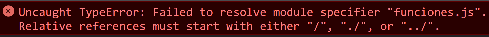
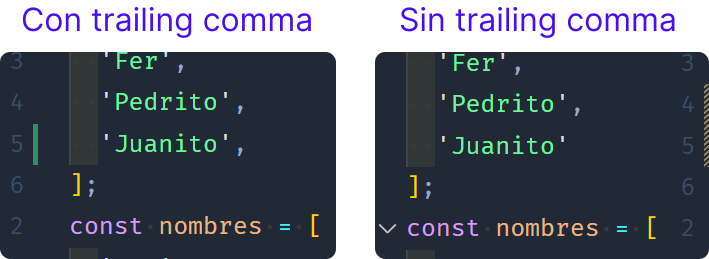

# ES6+ características (Parte 2)

Continuemos viendo lo nuevo en Javascript, recuerda que este es el segundo artículo en el que hablamos sobre las características de ES6+, si quieres consultar los demás aquí tienes los enlaces:

- [Parte 1](../es6-features/)
  > Funciones flecha, Interpolación, Desestructuración, Operador spread, Parámetros rest, Parámetros por defecto
- Parte 2 **(aquí estás)**
  > Promesas, Async/await, Encadenamiento opcional, Operador nullish, Módulos, Comas finales (trailing commas)
- [Parte 3](../es6-features-part-3/)
  > Map, Set, Clases, Atributos privados, métodos de objetos, arreglos, strings, promesas
- [Parte 4](../es6-features-part-4/)
  > Top-level await, toSorted, toReversed, toSpliced, with, findLast, findLastIndex, at

Así que comencemos:

<p style="text-align: center">
  
</p>

## [Promesas](https://developer.mozilla.org/es/docs/Web/JavaScript/Reference/Global_Objects/Promise)

Antes la asincronía en Javascript se manejaba con **callbacks** (funciones que se pasan como parámetro a otra función para ser ejecutadas en el futuro). Veamos un pequeño ejemplo:

```js
// Creamos la función que usaremos como callback
const saludar = () => console.log('Hola');

// Simulamos que esta función demora 3 segundos para ejecutar el callback
const funcionAsincrona = (callback) => {
  setTimeout(callback, 3000);
}

// 'saludar' se convierte en callback cuando la pasamos como parámetro
                    ↓
funcionAsincrona(saludar);
```

::: warning
Cuando se pasa un callback **NO** se utilizan paréntesis porque eso indicaría que la función se debe ejecutar y lo que se pasaría como parámetro sería el resultado y no la función como tal.

```js
funcionAsincrona(saludar()); // ❎ Incorrecto
funcionAsincrona(saludar); // ✅ Correcto
```

:::

A partir de ES6 se introdujeron las [promesas](https://developer.mozilla.org/es/docs/Web/JavaScript/Guide/Using_promises) para el manejo de código asíncrono, con las cuales podemos fácilmente obtener el resultado en caso de éxito o el error en caso de falla. La sintaxis es la siguiente:

```js
new Promise((resolve, reject) => {
  // el código asíncrono aquí
  if (validarSiArchivoExiste()) {
    resolve(); // Llamamos a 'resolve' para indicar que la promesa resolvió satisfactoriamente
  } else {
    reject(); // Llamamos a 'reject' para indicar que la promesa falló
  }
})
  .then((result) => {
    // aquí el código si la promesa es satisfactoria
  })
  .catch((error) => {
    // aquí el código si la promesa falla
  });
```

Expliquemos un poco el código.

1. Se debe crear un objeto **Promise** con la palabra reservada **new**.
2. Se debe pasar un callback que recibe como parámetros dos funciones **(resolve, reject)** con las cuales podemos indicar si la promesa fue resuelta con éxito o no. Estas funciones recibir un parámetro para enviar información como resultado.

```js
if (validarSiArchivoExiste()) {
  resolve('El archivo existe');
} else {
  reject('No se encontró el archivo');
}
```

3. Las promesas tienen un método **then** que se ejecuta cuando la promesa termina con éxito. Opcionalmente podemos recibir la información pasada al método **resolve** previamente.
4. En caso de error, llamamos al método **catch**.

::: tip
Para conocer más acerca de los callbacks y promesas te recomiendo leer mi artículo ["Infierno de Callbacks (Promesas y async/await)"](../callback-hell/)
:::

## [Async/await](https://developer.mozilla.org/es/docs/Learn/JavaScript/Asynchronous/Async_await)

Otra forma de manejar la asincronía en JS es con **async/await**, lo cual nos permite seguir usando promesas pero con un estilo de código síncrono. Veamos un ejemplo:

**Con promesas**

```js
obtenerUbicacionDocumento()
  .then((rutaDocumento) => leerDocumento(rutaDocumento))
  .then((documento) => console.log(documento))
  .catch((error) => console.log(error));
```

**Con async/await**

```js
try {
  // Usamos la palabra reservada 'await' para detener la ejecución del programa
  // y esperar el resultado de la promesa
  const rutaDocumento = await obtenerUbicacionDocumento();
  const documento = await leerDocumento(rutaDocumento);
  console.log(documento);
} catch {
  console.log(error);
}
```

Con la palabra reservada **await** forzamos al programa a detenerse y esperar la respuesta de promesa, simulando un estilo de programación síncrono como Java, Python, etc.

Y posiblemente te estés preguntando ¿dónde quedó el **async** del nombre? 🤔 Cuando esta característica fue agregada al estándar, era obligatorio crear un entorno de ejecución **async** para poder usar la palabra **await** dentro de él. Es decir, el código anterior debía ser encapsulado por una función **async**.

**Con declaración de función**

```js
async function procesarDocumento() {
  try {
    const rutaDocumento = await obtenerUbicacionDocumento();
    const documento = await leerDocumento(rutaDocumento);
    console.log(documento);
  } catch {
    console.log(error);
  }
}
```

**Con expresión de función**

```js
const procesarDocumento = async () => {
  try {
    const rutaDocumento = await obtenerUbicacionDocumento();
    const documento = await leerDocumento(rutaDocumento);
    console.log(documento);
  } catch {
    console.log(error);
  }
}
```

Pero esto ya no es necesario porque **async/await** tuvo tanto éxito que implemetaron otra característica que ahora permite usar la palabra **await** en el nivel más alto de ejecución sin necesidad de crear una función **async**. Esto se llama [Top-level await](https://github.com/tc39/proposal-top-level-await).

## [Encadenamiento opcional](https://developer.mozilla.org/es/docs/Web/JavaScript/Reference/Operators/Optional_chaining)

Estoy seguro que en tu camino como desarrollador te has encontrado con algo como esto:

```js
const empleado = {
  direccion: {
    calle: 'Calle 1',
  },
};

const empleadoCalle = empleado && empleado.direccion && empleado.direccion.calle || 'Sin calle';
```

Y esto se podría complicar mucho más pero ahora tenemos el encadenamiento opcional que nos permite acceder a propiedades anidadas usando el operador **`?.`** y en cuanto encuentre una propiedad que no existe en el objeto, detiene la lectura de propiedades y retorna **undefined**.

```js
// Si 'empleado' o 'direccion' no existen, retornará 'undefined'
const empleadoCalle = empleado?.direccion?.calle || 'No calle';
```

Pero el encadenamiento opcional no se limita solo a propiedades de objetos, podemos usarlo al obtener un item de un arreglo o al ejecutar un método:

```js
const empleados = ['Fer', 'Anahí', 'Sara'];
// Si existe el arreglo de empleados, obtenemos el índice 3.
// En caso contrario, retorna 'undefined'.
const empleado = empleados?.[1];

const empleadoConMetodo = {
  calcularSalario() {},
};
// Si el empleado tiene el método 'calcularSalario', lo ejecutamos.
// En caso contrario, retorna 'undefined'.
empleadoConMetodo.calcularSalario?.();
```

Al final, podemos encadenar tanto como queramos de una forma sencilla y segura para terminar con algo como esto:

```js
empleados?.[1]?.calcularSalario?.()?.total;
```

> Sé que esto ya se ve algo feo pero son casos con los que te podrías encontrar 😬.

## [Operador nullish](https://developer.mozilla.org/en-US/docs/Web/JavaScript/Reference/Operators/Nullish_coalescing_operator)

(Lo siento, no encontré la documentación oficial en español 😬)

El operador nullish **`??`** nos permite obtener un valor por defecto cuando al evaluar una variable, ésta tiene como valor `undefined` o `null`.

```js
const nombre = null;
console.log(nombre ?? 'Sin nombre');
// -> 'Sin nombre'
```

Es muy parecido al operador lógico OR `||` pero con la diferencia en los [valores falsy](../bang-bang-operator/) que evalúan.

**Valores falsy según operador**

<!-- prettier-ignore -->
| OR `||`           | Nullish coalescing `??` |
|-------------------|-------------------------|
| 0                 | null                    |
| "" (string vacío) | undefined               |
| false             |                         |
| undefined         |                         |
| null              |                         |
| NaN               |                         |

Por lo que dependiendo lo que necesites validar puedes usar uno u otro.

```js
const nombre = '';

const conOperadorOr = nombre || 'Sin nombre';
// -> 'Sin nombre'

const conOperadorNullish = nombre ?? 'Sin nombre';
// -> ''
```

:::warning
Pon mucho ojo 👁 en los valores falsy que cada operador evalúa.
:::

## [Módulos](https://developer.mozilla.org/es/docs/Web/JavaScript/Guide/Modules)

Los módulos de EcmaScript (ES modules) nos permiten organizar nuestro código en diferentes archivos y compartir solo los componentes que queramos. Para hacer esto los módulos llegaron con dos nuevas palabras mágicas `import` y `export`: la primera nos permite acceder a los componentes públicos de un módulo y la segunda nos permite especificar qué componentes van a ser públicos.

Para este ejemplo vamos a necesitar 2 archivos: `funciones.js` y `ejemplo.js`:

```js
// funciones.js
export default function suma(num1, num2) {
  return num1 + num2;
}
```

```js
// app.js
import suma from './funciones.js';

console.log(suma(1,2));
// -> 3
```

Lo que hicimos en el archivo `funciones.js` fue declarar que la función suma es pública, por lo que puede ser llamada desde `app.js`. Con la palabra `export` exponemos un componente de nuestro archivo y con la palabra `default` indicamos que cuando manden a llamar al archivo `funciones.js` siempre va a importar `suma` a menos que se indique lo contrario (lo vemos más abajo).

Por otro lado, en el archivo `app.js` importamos los componentes públicos de `funciones.js` usando las palabras: `import` y `from`. Con `import` especificamos el nombre de los componentes que necesitamos y con `from` indicamos el módulo que los contiene.

::: warning
Para direccionar a un módulo siempre debes usar una ruta de archivo **relativa** `./funciones.js`.

```js
// Correcto
import suma from './funciones.js';

// Incorrecto
import suma from 'funciones.js';
```

Si solo especificas el nombre del archivo, un error como el siguiente será lanzado:


:::

Existen dos formas de indicar que algo es público:

- **Por defecto (_default export_)**

  Es la forma que vimos previamente usando las palabras `export default`. Se usa normalmente cuando solo tienes un componente a ser exportado o cuando quieres indicar cual es el componente principal.

- **Por nombre (_named exports_)**

  Esta forma de exportar se usa cuando quieres que cada componente de tu módulo pueda ser accedido individualmente. Por ejemplo:

```js
// funciones.js
export const suma = (num1, num2) => num1 + num2;
export const resta = (num1, num2) => num1 - num2;
```

```js
// app.js
import { suma, resta } from './funciones.js';

console.log(suma(1,1));
// -> 2

console.log(resta(1,1));
// -> 0
```

:::warning
Todo lo que no sea **"exportado"** por definición es privado, es decir, no puede ser accedido desde otro archivo (módulo).
:::

<!-- TODO add ES modules link -->
<!-- Hay otras cosas importantes de los módulos pero eso lo revisamos a fondo en el artículo [Módulos de EcmaScript (ES modules)](../es-modules/). -->

## [Comas finales (trailing commas)](https://developer.mozilla.org/en-US/docs/Web/JavaScript/Reference/Trailing_commas)

(Lo siento, no encontré la documentación oficial en español 😬)

Te dejo esta [lectura](https://medium.com/@nikgraf/why-you-should-enforce-dangling-commas-for-multiline-statements-d034c98e36f8)(en inglés 😬) y esta [pregunta de StackOverflow](https://es.stackoverflow.com/questions/202727/como-funcionan-los-trailing-commas-en-javascript) para más información.

Sé que esta característica puede parecer muy poco útil (porque yo también lo pensé 😅) pero es importante principalmente para tener un mejor control de versiones en tu proyecto.

```js
// Sin "trailing comma"
const nombres = [
  'Fer',
  'Pedrito'
];

// Con "trailing comma"
const nombres = [
  'Fer',
  'Pedrito', <-
];
```

Cuando dejas una coma al final del último elemento de un arreglo/objeto/parámetros de función, permites que el controlador de versiones ([git](https://git-scm.com) no GitHub, ¡ojo! 👁) identifique de mejor manera las líneas que realmente tuvieron un cambio significativo.

Supongamos que agregamos un elemento a nuestro arreglo, si existe una coma final, `git` detectará que cambiamos 2 líneas. Esto no está mal pero realmente el cambio importante fue solo uno.

<p style="text-align: center">
  
</p>

De lado izquierdo (con trailing comma) se detectó solo un cambio y de lado derecho (sin trailing comma) fueron dos.

## Conclusión

Espero te haya ayudado a comprender algunas de las características importantes de Javascript y puedas comenzar a usarlas en tu día a día.
Te veo pronto. Happy coding! 🥸

<Disqus />
