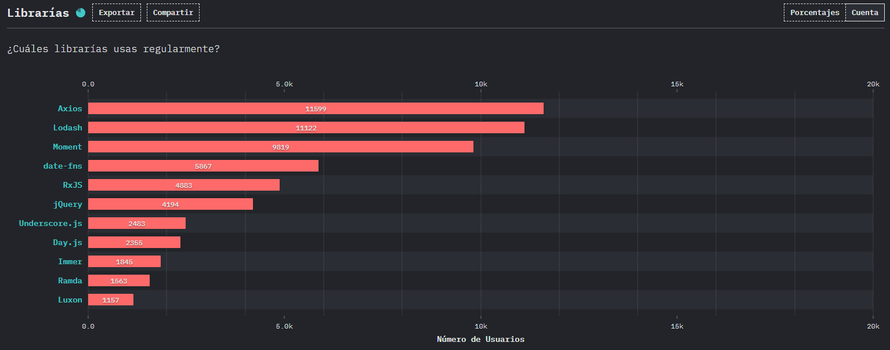
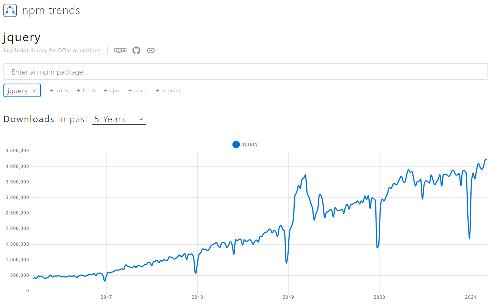

# jQuery

Hoy hablaremos del rey de las librerías de Javascript, el amado y odiado [jQuery](https://jquery.com/) 👑. Estoy seguro que ya habrás escuchado de él, ya que a pesar de que en los últimos años ha caído su uso, aún en pleno 2021 sigue siendo una de las librerías más usadas.

De hecho, según la encuesta ["State of JS 2020"](https://2020.stateofjs.com), jQuery está en el top 10 de librerías más usadas.



Y revisando la tendencia en [npm trends](https://www.npmtrends.com/jquery) me sorprendió que es positiva 🤯.



Así que veamos algunos conceptos básicos que te pueden servir si algún día requieres usar esta librería.

## Instalación

Dependiendo la configuración de tu proyecto, tienes varias opciones para instalar jQuery pero hoy solo veremos la más sencilla:

> Puedes revisar todas las opciones [aquí](https://jquery.com/download/).

**CDN**

Agrega el script con el link al [CDN](https://es.wikipedia.org/wiki/Red_de_distribuci%C3%B3n_de_contenidos) justo antes del script donde usarás jQuery.

```html
<script src="https://code.jquery.com/jquery-3.6.0.min.js"></script>
<!-- Aquí tu script -->
```

::: tip
Es buena práctica poner los scripts de JS justo antes de cerrar la etiqueta **\<body\>**.
:::

## Función `$`

jQuery crea una función global con el alias `$`. Para cualquier cosa que quieras de jQuery necesitarás invocar al signo de pesos.

Te muestro algunos ejemplos:

```js
// Obtener un elemento del DOM por ID.
// Nos regresa un objeto de jQuery con referencia al elemento.
$('#mi-boton');

// Obtener un elemento del DOM y agregarle un evento 'click'.
$('#mi-boton').click(() => console.log('Click en el botón'));
```

Esta función recibe un [selector CSS](https://developer.mozilla.org/es/docs/Web/CSS/CSS_Selectors), que son la forma de identificar elementos en el DOM `e.g. #un-id, .una-clase, h1`. Con este selector, jQuery nos retornará un objeto con referencia a uno o más elementos a los cuales podremos aplicar la gran variedad de funcionalidades que esta librería nos provee.

Sé que suena muy complicado pero con el tiempo será lo más normal del mundo. Solo recuerda esta estructura:

```js
$(selector).metodo(callback);
```

> El **callback** puede ser opcional dependiendo del **método**.

## Eventos

Lo más común que podemos hacer con jQuery es el manejo de eventos (click, input, change, etc.) que ocurren en los elementos de nuestro HTML. Esto en Javascript vainilla (nativo) se vería así:

```js
const boton = document.querySelector('#mi-boton');
boton.addEventListener('click', () => console.log('Click en el botón'));
```

Y en jQuery sería:

```js
$('#mi-boton').click(() => console.log('Click en el botón'));
```

> En este [enlace](https://api.jquery.com/category/events/) puedes revisar todos los eventos que maneja jQuery.

También podemos trabajar con el elemento que disparó el evento dentro del callback, pero en estos casos no podemos usar [funciones flecha](https://developer.mozilla.org/es/docs/Web/JavaScript/Reference/Functions/Arrow_functions) por la manera en que manejan el [contexto de ejecución](../context/).

Javascript vainilla (nativo):

```js
const input = document.querySelector('#mi-input');
input.addEventListener('change', function() {
  // `this` hace referencia al elemento input.
  console.log(this.value);
});
```

jQuery:

```js
$('#mi-input').change(function() {
  // `$(this)` nos regresa el input pero como objeto de jQuery.
  console.log($(this).val());
});
```

> Aquí puedes aprender más de [val()](https://api.jquery.com/val).

## Manipular el DOM

Otro caso muy común es agregar, remover o editar elementos HTML. Veamos estos 3 ejemplos:

- **Agregar un elemento a una lista.**

Con `append` podemos pasar un string con la estructura HTML del elemento o elementos a agregar.

```js
$('ul').append('<li>Nuevo elemento.</li>');
```

- **Remover el último elemento de una lista.**

`remove` permite eliminar un elemento del DOM. Para este caso usamos `last` para obtener el último elemento de una colección.

<!-- prettier-ignore -->
```js
$('ul li').last().remove();
```

- **Editar todos los items de una lista.**

`each` recorre cada elemento dentro una colección y `html` cambia el contenido dentro del elemento.

```js
$('ul li').each(function() {
  $(this).html('Nuevo contenido');
});
```

> Enlaces a la documentación: [append](https://api.jquery.com/append), [last](https://api.jquery.com/last), [remove](https://api.jquery.com/remove/), [each](https://api.jquery.com/each), [html](https://api.jquery.com/html).

## Peticiones HTTP

Finalmente, también podemos realizar peticiones [HTTP](https://developer.mozilla.org/es/docs/Web/HTTP) usando [AJAX](https://developer.mozilla.org/es/docs/Web/Guide/AJAX).

Podemos usar el método `ajax` y pasar la configuración completa.

```js
// GET
$.ajax({
  url: 'http://misitio.com/empleados',
  method: 'GET',
})
  .done((data) => console.log(data))
  .fail((error) => console.log(error));

// POST
$.ajax({
  url: 'http://misitio.com/empleados',
  method: 'GET',
  data: { nombre: 'Fer' },
  dataType: 'json',
})
  .done((data) => console.log(data))
  .fail((error) => console.log(error));
```

O los atajos `get` y `post`.

```js
$.get('http://misitio.com/empleados')
  .done((data) => console.log(data))
  .fail((error) => console.log(error));

$.post('http://misitio.com/empleados', { nombre: 'Fer' })
  .done((data) => console.log(data))
  .fail((error) => console.log(error));
```

## Conclusión

Espero te ayude esta pequeña introducción a jQuery, vimos 3 de los principales usos de esta librería pero el ecosistema basado en ella es inmenso, así que revisa la [documentación](https://jquery.com/) para conocer más.

Aunque no es una librería mala si estás creando proyectos nuevos, te recomiendo **ya no usar jQuery**. Hace algunos años era la única opción de codificar decentemente en JS pero ahora muchas cosas ya se pueden hacer gracias a las [nuevas características de ECMAScript2015](../es6-features/).

Además, usando frameworks frontend como [Angular](https://angular.io/), [React](https://es.reactjs.org/), [Vue](https://vuejs.org/) o [Svelte](https://svelte.dev/) se pueden crear aplicaciones usando la programación reactiva de una manera muy elegante. **Olvídate de actualizar el DOM manualmente y enfócate en la lógica del negocio**.

Happy coding! 🥸

<Disqus />
