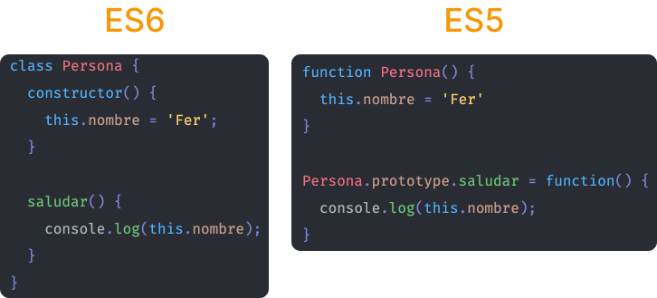
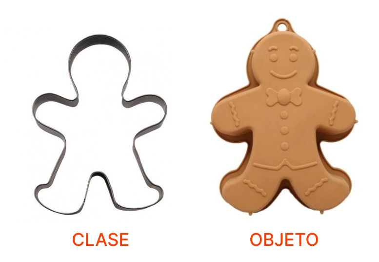

# Programación Orientada a Objetos (POO)

Uno de los [paradigmas de programación](https://es.wikipedia.org/wiki/Paradigma_de_programaci%C3%B3n) más importantes y tal vez el más conocido, es el [**orientado a objetos**](https://es.wikipedia.org/wiki/Programaci%C3%B3n_orientada_a_objetos), ya que la mayoría de lenguajes te permite implementarlo y un gran porcentaje de sistemas en el mundo lo usan.

Este paradigma busca llevar el mundo real a lo digital a través de modelos, es decir, hace una abstracción de las características y funcionalidades de las cosas (objetos).

<p style="text-align: center">
  
</p>

Aunque Javascript no es orientado a objetos, gracias a las nuevas características implementadas en el estándar ([ES6+](https://www.w3schools.com/js/js_es6.asp)), ahora tenemos [clases](https://developer.mozilla.org/es/docs/Web/JavaScript/Reference/Classes), herencia, getters, setters, entre otras características de este paradigma. Así que comencemos a ver cómo implementar orientación a objetos en JS 😎.

::: warning
Javascript es un lenguaje [basado en prototipos](https://es.wikipedia.org/wiki/Programaci%C3%B3n_basada_en_prototipos), por lo que internamente funciona de manera diferente a lenguajes tradicionales orientados a objetos como Java o Python.

Las clases en Javascript son [azúcar sintáctico](https://es.wikipedia.org/wiki/Az%C3%BAcar_sint%C3%A1ctico), es decir, nos facilitan la forma en que escribimos el código pero no modifican la funcionalidad interna del lenguaje.

Para ejemplificar esto, te dejo la comparación entre la sintaxis de clases (ES6) y las funciones constructoras (ES5), las cuales son la manera nativa en que trabaja Javascript.

<p style="text-align: center">
  
</p>
:::

## Clases

Lo más importante cuando hablamos de POO (Programación Orientada a Objetos) son las **clases**, ya que en ellas definimos los **atributos** (características) y **métodos** (funcionalidades) de nuestros objetos. Imagina que quieres hacer galletas, **el molde sería la clase y cada galleta preparada con ese molde sería un objeto**.

<p style="text-align: center">
  
</p>

Trabajaremos con el ejemplo de una persona porque es fácil de comprender pero las clases no se limitan a personas, cualquier entidad (persona, animal, cosa) con características y funcionalidades definidas puede convertirse en una clase.

Una clase se compone de **atributos** y **métodos**.
- **Atributos**: Características propias de los objetos (¿qué posee o tiene?).
- **Métodos**: Funcionalidades propias de los objetos (¿qué puede hacer?).

En nuestro caso, una persona tiene:
- **Atributos**: nombre, apellido, color de ojos, comida favorita.
- **Métodos**: saluda, come, camina.

Y en código esto se vería así:

```js
class Persona { // (1)
  constructor() { // (2)
    this.nombre = 'Fernando'; // (3)
    this.apellido = 'García';
    this.colorOjos = 'café';
    this.comidaFavorita = 'pizza';
  }

  comer() { // (4)
    console.log(`Estoy comiendo una ${this.comidaFavorita}`);
  }

  correr() { // (4)
    console.log('Estoy corriendo');
  }

  saludar() { // (4)
    console.log(`Hola, me llamo ${this.nombre} ${this.apellido}`);
  }
}
```

1. Como puedes ver, usamos la palabra reservada **class** y definimos un nombre para nuestra clase, siempre en singular ya que una clase modela a un objeto en particular.
2. Existe un método especial llamado **constructor** el cual es el primer método que se manda a llamar cuando creamos un objeto de dicha clase (esto lo hace JS internamente). En este método se define todo lo que un objeto debe tener en el momento que se crea, es decir, valores iniciales.
3. Cada atributo se crea como una propiedad del objeto **this**, el cual hace referencia al objeto que se está creando.
4. Los métodos se definen como funciones dentro de las cuales podemos acceder a los atributos previamente declarados.

::: tip
Por convención el nombre de las clases siempre se escribe en **UpperCamelCase**, es decir, la primera letra de cada palabra en mayúsculas (ej. Persona, Auto, Tarjeta, etc.).
:::

::: danger
Ten cuidado con agregar comas para separar los métodos dentro de una clase ya que esto resultará en un error de sintaxis.

```js
correr() {
  console.log('Estoy corriendo');
}, // SyntaxError: Unexpected token ','

saludar() {
  console.log(`Hola, me llamo ${this.nombre} ${this.apellido}`);
}
```
:::

Para crear un objeto de nuestra clase **Persona** usamos la palabra reservada **new** y agregamos paréntesis como si estuviéramos ejecutando una función.

```js
const persona = new Persona();
persona.saludar();
// -> Hola, me llamo Fernando García
persona.comer();
// -> Estoy comiendo una pizza
persona.correr();
// -> Estoy corriendo
console.log(persona.colorOjos);
// -> café
```

::: tip
Usamos la notación de punto para acceder a los atributos y métodos de un objeto.
:::

Pero hay un pequeño problema con nuestra clase, cualquier objeto que creemos va a tener los mismos valores para sus atributos.

```js
const personaUno = new Persona();
console.log(personaUno.nombre);
// -> Fernando

const personaDos = new Persona();
console.log(personaDos.nombre);
// -> Fernando
```

Para solucionar esto, nuestro método especial **constructor** puede recibir como parámetros los valores iniciales con lo que queremos que se cree nuestro objeto. Así que modifiquemos un poco nuestra clase y la manera en que la mandamos a llamar:

```js
class Persona {
  constructor(nombre, apellido, colorOjos, comidaFavorita) {
    this.nombre = nombre;
    this.apellido = apellido;
    this.colorOjos = colorOjos;
    this.comidaFavorita = comidaFavorita;
  }

  // métodos...
}

const fernando = new Persona('Fernando', 'García', 'café', 'pizza');
console.log(fernando.nombre);
// -> Fernando

const pedro = new Persona('Pedro', 'Pérez', 'azul', 'hamburguesa');
console.log(pedro.nombre);
// -> Pedro
```

::: tip
Cuando utilizas parámetros debes tener cuidado con el orden en que están definidos porque es el mismo orden en el que los debes pasar cuando crees un nuevo objeto.

Para evitar una equivocación, una buena práctica es definir un objeto con todas las propiedades necesarias como parámetro y aplicar la [desestructuración](https://developer.mozilla.org/es/docs/Web/JavaScript/Reference/Operators/Destructuring_assignment).

```js
class Persona {
  // Ahora los valores son propiedades de un objeto.
  // Ojo con las llaves 👀.
  constructor({ nombre, apellido, colorOjos, comidaFavorita }) {
    this.nombre = nombre;
    this.apellido = apellido;
    this.colorOjos = colorOjos;
    this.comidaFavorita = comidaFavorita;
  }

  // métodos...
}

const fernando = new Persona({
  nombre: 'Fernando',
  apellido: 'García',
  colorOjos: 'café',
  comidaFavorita: 'pizza',
});
console.log(fernando.nombre);
// -> Fernando

const pedro = new Persona({
  nombre: 'Pedro',
  apellido: 'Pérez',
  colorOjos: 'azul',
  comidaFavorita: 'hamburguesa',
});
console.log(pedro.nombre);
// -> Pedro
```

[Aquí puedes revisar el código completo 👀](https://gist.github.com/FerGv/cc4eb2ce4bb225b05ad070eebf3b5e36)
:::

## Conclusión

Esta fue solo una pequeña introducción a la programación orientada a objetos en Javascript. Todavía hay conceptos como la herencia, getters, setters, encapsulamiento y algunos más por conocer, pero espero que al menos el concepto de clases sea un poco más entendible ahora 🤭.

Te veo pronto. Happy coding! 🥸

<Disqus />
