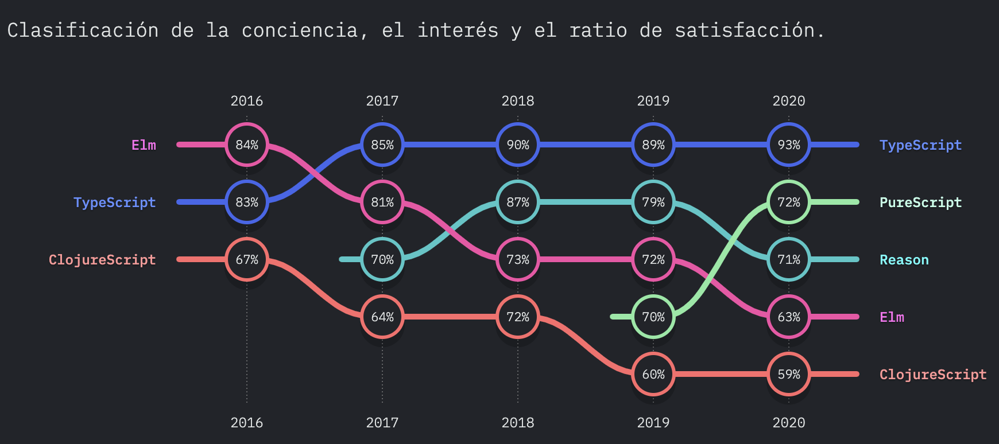
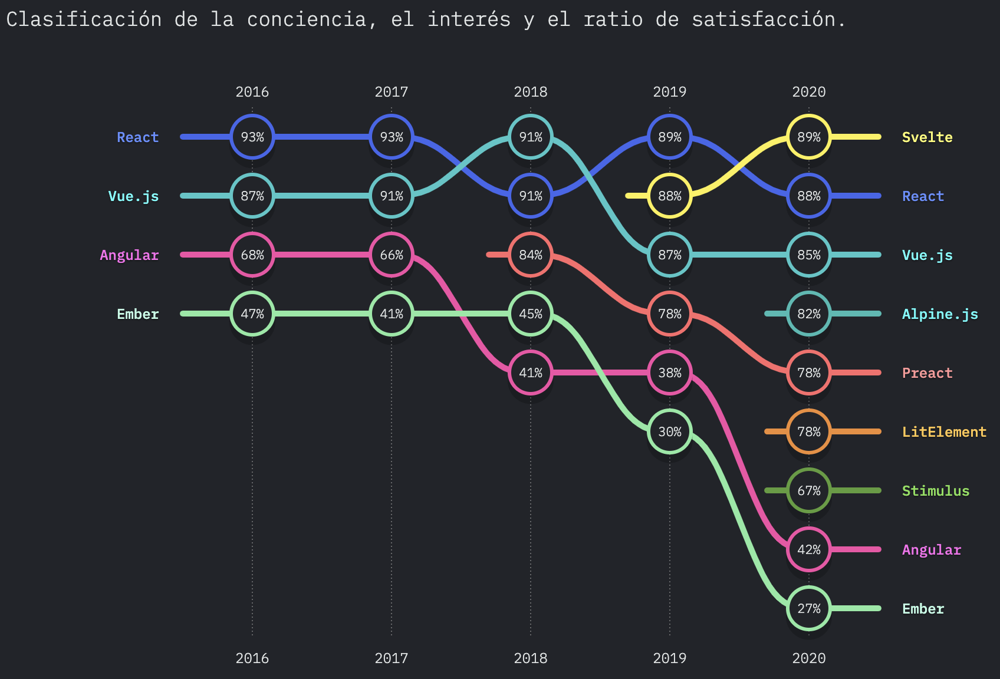

# State of JS 2020: Typescript y Svelte

Hace unos días salieron los resultados de la encuesta ["State of JS 2020"](https://2020.stateofjs.com/es-ES/), una famosa encuesta que año tras año recopila información sobre el estado actual de Javascript en el mundo.

En esta encuesta podemos encontrar muchas categorias como Frontend Frameworks, Backend Frameworks, Herramientas de Testing, Sabores de Javascript, entre otras. Actualmente, el ecosistema de librerías para Javascript es inmenso, y así como unas crecen en popularidad y uso, muchas otras decaen. Hoy hablaremos de dos en específico que llamaron mi atención: Typescript y Svelte.

Estas dos tecnologías fueron las ganadoras en porcentaje de satisfacción en su ramo (Sabores de JS y Frontend Frameworks, respectivamente), siendo Svelte la gran sorpresa porque se posicionó por encima de React.

**Sabores de JS**


**Frontend Frameworks**


## Typescript

Typescript es un superset de Javascript, es decir, posee todas las características de JS pero nos brinda algunas más. La principal de ellas es el tipado estático.

```javascript
// JS - sin tipado
const edad = 23;
const nombre = 'Fer';
const esAdmin = true;
```

```typescript
// TS - con tipado
const edad: number = 23;
const nombre: string = 'Fer';
const esAdmin: boolean = true;
```

Si no llevas mucho tiempo programando en JS o si no has trabajado en alguna aplicación grande, posiblemente pienses que no vale la pena agregarle esta complejidad al código. Y yo entiendo, yo huí de Java porque no me gustaba su sintaxis tan estricta y verbosa, pero a la larga las ventajas del tipado hacen que te olvides de lo tedioso que es escribirlo.

Te recomiendo que te des una vuelta por su [página oficial](https://www.typescriptlang.org/) y le des una oportunidad. Estoy seguro que no te arrepentirás 😉.

## Svelte

Svelte es el chico nuevo del barrio, el más reciente de los frameworks frontend (y si, otro más que hay que aprender 🙄).


Y antes de que salgas corriendo, déjame decirte que la verdad Svelte llega con una propuesta bastante interesante. De las 4 principales opciones (Angular, React, Vue, Svelte), este último es el que parece apegarse más al JS vainilla de toda la vida. Te muestro un pequeño ejemplo:

```html
<script>
  // Variable reactiva
  let nombre = 'Fer';

  // Método reactivo
  const cambiarNombre = () => nombre = 'Pedro';
</script>

<style>
p {
  color: red;
}
</style>

<p>Hola {nombre}</p>

<button on:click={cambiarNombre}>Cambiar nombre</button>
```

Como ves, con el simple hecho de declarar una variable, automáticamente se vuelve reactiva (de hecho, Svelte es tan inteligente que solo la vuelve reactiva según el uso que se le dé, pero esos son detalles técnicos para otro artículo). Y para declarar métodos reactivos es tan simple como declarar una función. Todo esto dentro una etiqueta `<script>`.

En caso de querer estilos, los ponemos dentro de un `<style>` y no debemos preocuparnos de escribir clases con nombres super extraños para evitar colisiones. Svelte encapsula los estilos de cada componente.
Y finalmente, todo lo que no sea JS ni CSS, se pone libremente debajo. Así de fácil, así de sencillo.
Si esto te sorprendió, te recomiendo echarle un ojito a su [documentación](https://svelte.dev/) 👁.

::: tip
Por cierto, mi página personal [fergv.com](https://fergv.com) está hecha con Svelte y [Sapper](https://sapper.svelte.dev/) (el framework de Svelte). Te dejo el link al [repositorio](https://github.com/FerGv/FerGv.github.io) por si quieres revisar a detalle.
:::

Bueno, esto es todo por hoy, espero hayas disfrutado la lectura y nos vemos en el siguiente artículo.

Happy coding! 🥸

<Disqus />
