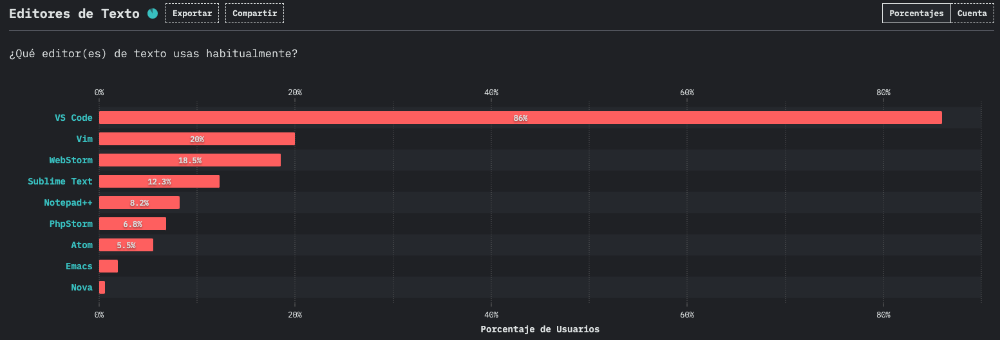

# Visual Studio Code

La herramienta más poderosa para un programador siempre será su [editor de código](https://es.wikipedia.org/wiki/Editor_de_c%C3%B3digo_fuente), ya que es como el Mjolnir para Thor.

  

Tú puedes escribir código en donde quieras realmente (terminal, bloc de notas, editor de código, [IDE](https://es.wikipedia.org/wiki/Entorno_de_desarrollo_integrado)), dependiendo de tus gustos y habilidades.

> Mis respetos para los que programan en terminal 😎

Lo importante de cada herramienta es qué tanto la puedas personalizar para sacarle el mayor provecho y ser más eficiente a la hora de programar. Yo he utilizado varios editores de código e IDEs como [Sublime Text](https://www.sublimetext.com/), [Atom](https://atom.io/), [NetBeans](https://netbeans.apache.org/), [PyCharm](https://www.jetbrains.com/es-es/pycharm/) pero al final el que más me ha convencido por todo lo que ofrece y el que uso en mi día a día es [Visual Studio Code (VSCode)](https://code.visualstudio.com/).

Este editor fue creado por Microsoft en 2015 y en los últimos años se ha convertido en el editor más usado por la comunidad de desarrollo web, según los datos de la encuesta anual ["State of JS 2020"](https://2020.stateofjs.com/es-ES/other-tools/).

Entre las principales características que VSCode nos ofrece están:
- **Intellisense** (autocompletado de código)
- **Debug** (ejecutar código en modo de depuración de errores)
- **Git/GitHub** (integra una interfaz para manipular Git fácilmente y conectarse a GitHub)
- **Extensiones** (posibilidad de extender la funcionalidad estándar a través de [plugins](https://es.wikipedia.org/wiki/Complemento_(inform%C3%A1tica)))
- **Terminal integrada** (no tienes que salir de tu editor para usar la terminal)

Así que en esta sección de mi blog hablaré acerca de cómo puedes personalizar este editor para que te ayude a escribir código de manera eficiente y algunas cosas más.

- [Extensiones (Parte 1)](./extensions/)
