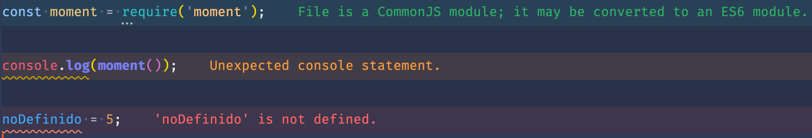
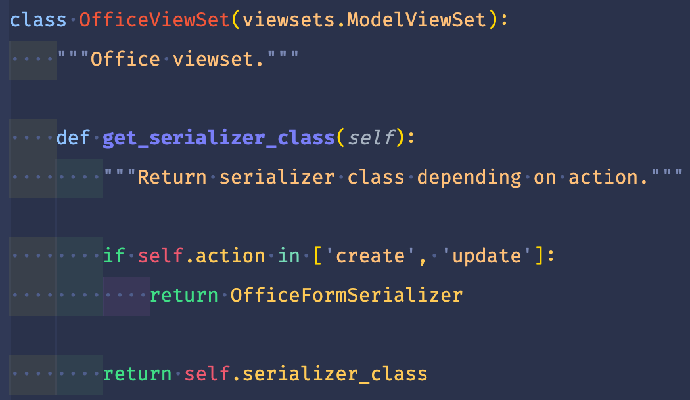
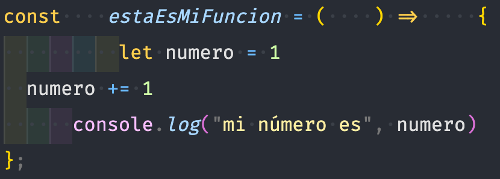
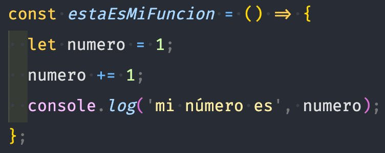
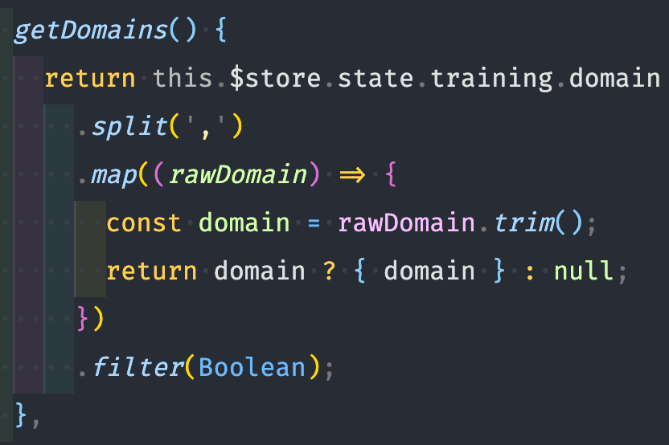
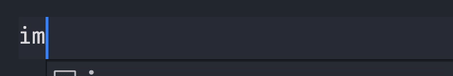
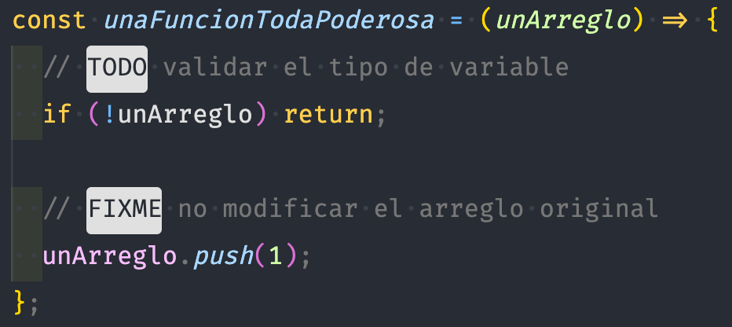
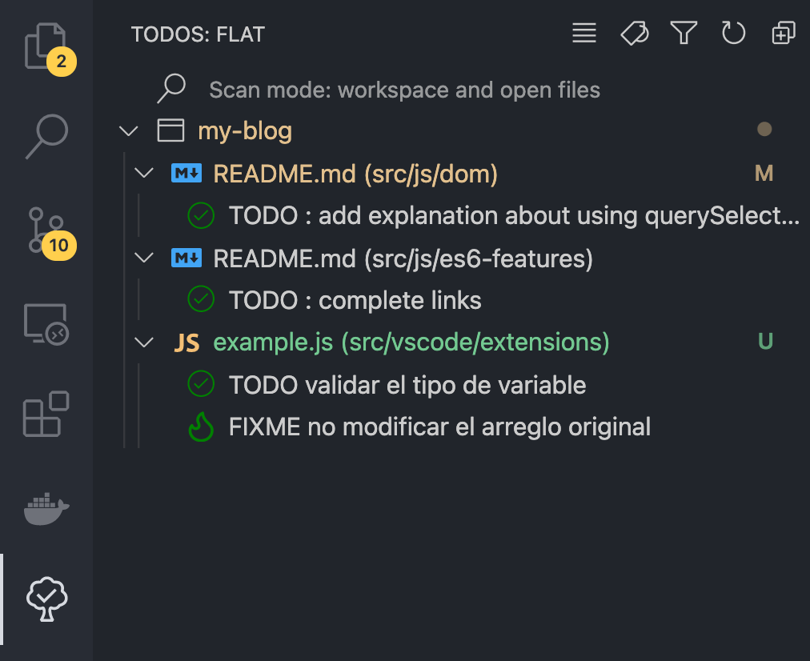
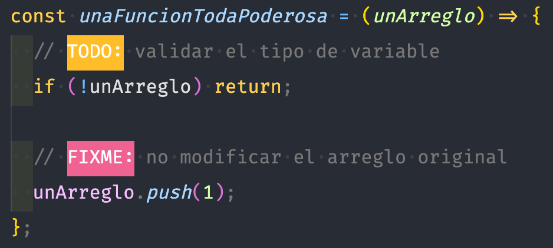
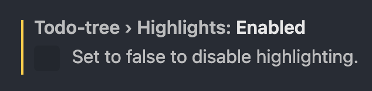

# Extensiones (Parte 1)

Las extensiones son una parte muy importante de un editor, ya que nos permiten extender la funcionalidad del mismo. Existen de todo tipo: para lenguajes de programación en específico, autocompletado, indentación, formatear código, agregar atajos de teclado, snippets personalizados, etc.

Hoy te mostraré las principales que utilizo, las cuales están enfocadas al desarrollo web con JS.

<p style="text-align: center">
  
</p>

## Extensiones populares

### [DotENV](https://marketplace.visualstudio.com/items?itemName=mikestead.dotenv)

DotENV nos ayuda a resaltar la sintaxis de nuestros archivos `.env`. De esta manera es más fácil identificar cuál es la clave y cuál el valor.

<p style="text-align: center">
  
</p>

### [Duplicate action](https://marketplace.visualstudio.com/items?itemName=mrmlnc.vscode-duplicate)

Muchas veces copiamos y pegamos el contenido de un archivo en otro. Para facilitar esta tarea, podemos simplemente seleccionar una opción en el menú desplegable.

<p style="text-align: center">
  
</p>

### [EditorConfig](https://marketplace.visualstudio.com/items?itemName=EditorConfig.EditorConfig)

Esta extensión nos ayuda a establecer ciertos parámetros que el editor debe seguir cada que formatee un código, por ejemplo, el tamaño de indentación, el uso de espacios, etc. Todas estas configuraciones se establecen en un archivo `.editorconfig`.

::: tip
Es una buena práctica establecer un archivo `.editorconfig` en tus proyectos para estandarizar las guías de estilo en un equipo de trabajo.

Para conocer más, visita la página oficial de [EditorConfig](https://editorconfig.org/).
:::

<p style="text-align: center">
  
</p>

### [Error Lens](https://marketplace.visualstudio.com/items?itemName=usernamehw.errorlens)

Identificar errores en el código mientras se escribe siempre ayuda a reducir el tiempo de depuración. Dependiendo de cómo tengas configurado algún [linter](https://es.wikipedia.org/wiki/Lint), esta extensión será capaz de mostrar a nivel de línea el error o advertencia que se haya detectado.

<p style="text-align: center">
  
</p>

### [ESLint](https://marketplace.visualstudio.com/items?itemName=dbaeumer.vscode-eslint)

Usar un [linter](https://es.wikipedia.org/wiki/Lint) de código es muy importante para detectar y corregir errores. El más famoso para Javascript es [ESLint](https://eslint.org/) y la extensión del mismo nombre nos permite integrarlo a VSCode. Te recomiendo leer más acerca de esta extraordinaria herramienta en su [página oficial](https://eslint.org/).

### [Indent Rainbow](https://marketplace.visualstudio.com/items?itemName=oderwat.indent-rainbow)

La indentación (sangría, tabulación) del código es un factor que afecta directamente a la legibilidad del mismo pero en algunos lenguajes de programación como Python, es más que una buena práctica, es requisito para que funcione correctamente.

Por ello, con esta extensión podrás identificar fácilmente cada nivel de indentación.

<p style="text-align: center">
  
</p>

### [Live Server](https://marketplace.visualstudio.com/items?itemName=ritwickdey.LiveServer)

Cuando estás desarrollando un sitio web, una de las cosas que más tediosas pueden llegar a ser es el recargar la página para que tus cambios se vean reflejados. Puede parecer algo simple y hasta absurdo pero creéme que agradecerás el no tener que hacerlo nunca más 😁.

Instala la extensión, da click derecho sobre tu archivo y elige "Abrir con Live server", guarda tus cambios y disfruta 😀.

<p style="text-align: center">
  
</p>

### [Prettier](https://marketplace.visualstudio.com/items?itemName=esbenp.prettier-vscode)

Dentro de las buenas prácticas se encuentra el escribir código legible y bien formateado, pero es tan común olvidar un punto y coma que mejor hay que dejar que alguien lo haga por nosotros. Para cumplir esta función tenemos **Prettier**, un formateador de código. Deja que él se encargue del trabajo sucio como la indentación, puntos y comas, comillas, etc. y mejor enfócate en hacer algo increíble 😎.

**Antes**
<p style="text-align: center">
  
</p>

**Después**
<p style="text-align: center">
  
</p>

### [Rainbow Brackets](https://marketplace.visualstudio.com/items?itemName=2gua.rainbow-brackets)

Cuando el código comienza a hacerse complejo, es difícil distinguir donde empieza o termina una función, una clase, un objeto, un arreglo, etc. Así que una pequeña ayuda es ponerle color a cada par de llaves, paréntesis o corchetes.

<p style="text-align: center">
  
</p>

<p style="text-align: center">
  
</p>

### [Bracket Padder](https://marketplace.visualstudio.com/items?itemName=viablelab.bracket-padder)

Esta extensión es un gusto personal (tal vez un TOC 😂) porque no me gusta abrir un par de llaves y continuar escribiendo todo pegado, y si eres un psicópata como yo, esta extensión te quitará mucho estrés, ya que al momento de escribir un par de llaves y presionar la barra espaciadora, automáticamente se agregarán los espacios necesarios para que lo que escribas no quede todo junto.

<p style="text-align: center">
  
</p>

### [Sublime Text Keymap](https://marketplace.visualstudio.com/items?itemName=ms-vscode.sublime-keybindings)

Mis inicios en la programación fueron con [Sublime Text](https://www.sublimetext.com/) y me encantaba porque era muy personalizable y gracias a sus atajos de teclado escribías código muy rápido.

Al final dejé Sublime 🥲 pero no sus atajos 🤭. Entre todos ellos podemos encontrar el duplicar una línea, seleccionar todas las coincidencias, agregar/remover comentarios, entre muchos otros.

Si eres fan de Sublime estoy seguro que amarás esta extensión, si no, también te recomiendo que le eches un ojito 👁, tal vez pueda convencerte.

### [Todo Tree](https://marketplace.visualstudio.com/items?itemName=Gruntfuggly.todo-tree)

Finalmente, aunque siempre quisiéramos entregar el mejor código, siguiendo las mejore prácticas, con todas las funcionalidades posibles, la verdad es que cuando tienes que cumplir tiempos de entrega, la mayoría de las veces dejarás cosas pendientes o mal hechas. Pero esto no quiere decir que se deben quedar así, puedes dejar un pequeño comentario que te lo recuerde como este:

<p style="text-align: center">
  
</p>

Pero conforme crece tu proyecto, va a ser muy difícil que recuerdes dónde dejaste esos comentarios. Es por ello que esta extensión organiza todos ellos y te los ofrece de una manera muy clara y fácil.

<p style="text-align: center">
  
</p>

Y puedes combinar esta extensión con [TODO Highlight](https://marketplace.visualstudio.com/items?itemName=wayou.vscode-todo-highlight) para agregarle color a las palabras clave y sea todavía más claro de leer en el código.

<p style="text-align: center">
  
</p>

Solo realiza la siguiente configuración y listo:

<p style="text-align: center">
  
</p>

## Archivo de extensiones recomendadas

Las extensiones que te acabo de mostrar son las más comunes en mi día a día, es por ello que en cada editor que uso (personal o de trabajo) las tengo que instalar. Y esto se puede volver algo tedioso porque las tengo que buscar por separado y puede ser que se me olvide alguna. Además, si alguien más llegara a trabajar en el mismo proyecto que yo, me gustaría que también usara estas extensiones para mantener un estándar.

Para esto VSCode nos permite crear un archivo en el que podemos indicar las extensiones recomendadas para cada proyecto. Así, al abrir el proyecto en el editor, éste te preguntará si deseas instalar las extensiones y con un solo click tendrás al instante todas ellas.

Para crearlo, necesitas primero crear una carpeta llamada `.vscode` (el punto es importante). Y dentro crear un archivo llamado `extensions.json` con la siguiente estructura:

```json
// .vscode/extensions.json
{
  "recommendations": [
    "mikestead.dotenv",
    "mrmlnc.vscode-duplicate",
    "editorconfig.editorconfig",
    "usernamehw.errorlens",
    "dbaeumer.vscode-eslint",
    "oderwat.indent-rainbow",
    "ritwickdey.liveserver",
    "esbenp.prettier-vscode",
    "2gua.rainbow-brackets",
    "viablelab.bracket-padder",
    "ms-vscode.sublime-keybindings",
    "gruntfuggly.todo-tree"
  ],
  "unwantedRecommendations": []
}
```

Es un objeto con dos propiedades que son arreglos: **recommendations** y **unwantedRecommendations**. La primera es para las extensiones que se quiere recomendar y la segunda para las que no.

La estructura de cada extension es `<autor>.<extension>` y lo puedes encontrar fácilmente en la página de información de cada extensión, justo a lado del nombre.

<p style="text-align: center">
  
</p>

## Conclusión

Las extensiones te pueden ayudar a personalizar tu editor de código para ser más eficiente al momento de programar, ya que como viste anteriormente son muy variadas sus funcionalidades. Por ello te recomiendo que busques aquellas que te ayuden específicamente a las actividades que tú realizas. Estoy seguro que te sorprenderá el potencial de ellas.

Happy coding! 🥸

<Disqus />
