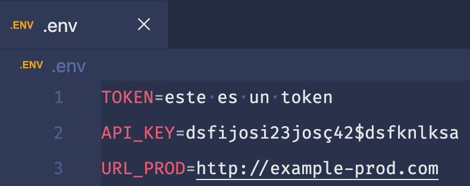
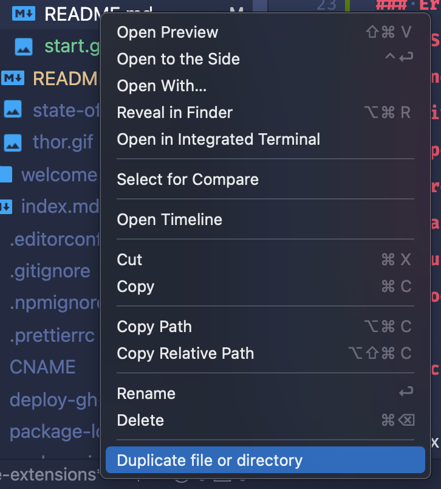
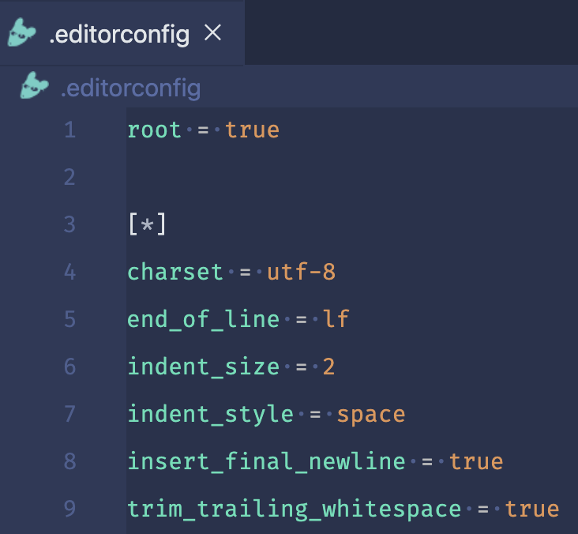
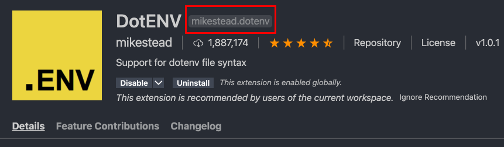

# Extensiones (Parte 1)

Las extensiones son una parte muy importante de un editor, ya que nos permiten extender la funcionalidad del mismo. Existen de todo tipo: para lenguajes de programación en específico, autocompletado, indentación, formatear código, agregar atajos de teclado, snippets predeterminados, etc.

Hoy te mostraré las principales que uso, están enfocadas principalmente para desarrollo web con JS.

<p style="text-align: center">
  
</p>

## Extensiones populares

### [DotENV](https://marketplace.visualstudio.com/items?itemName=mikestead.dotenv)

DotENV nos ayuda a aplicar color a nuestro archivos `.env`. De esta manera es más fácil identificar cuál es la clave y cuál el valor.

<p style="text-align: center">
  
</p>

### [Duplicate action](https://marketplace.visualstudio.com/items?itemName=mrmlnc.vscode-duplicate)

Muchas veces copiamos y pegamos el contenido de un archivo en otro. Para facilitar esta tarea, podemos simplemente seleccionar una opción en el menú desplegable.

<p style="text-align: center">
  
</p>

### [EditorConfig](https://marketplace.visualstudio.com/items?itemName=EditorConfig.EditorConfig)

Esta extensión nos ayuda a establecer ciertos parámetros que el editor debe seguir cada que formatee un código como el tamaño de indentación, el uso de espacios, etc.

::: tip
Es una buena práctica establecer un archivo `.editorconfig` en tus proyectos para estandarizar las guías de estilo en un equipo de trabajo.

Para conocer más, visita la página oficial de [EditorConfig](https://editorconfig.org/).
:::

<p style="text-align: center">
  
</p>

### Error Lens

### ESLint

### Indent Rainbow

### Live Server

### Open In Browser

### Prettier

### Rainbow Brackets

### Sublime Text Keymap

### Todo Tree

## Archivo de extensiones recomendadas

Las extensiones que te acabo de mostrar son las más comunes en mi día a día, es por ello que en cada editor que uso (personal o de trabajo) las tengo que instalar. Y esto se puede volver algo tedioso porque las tengo que buscar por separado y puede ser que se me olvide alguna. Además, si alguien más llegara a trabajar en el mismo proyecto que yo, me gustaría que también usara estas extensiones para mantener un estándar.

Para esto VSCode nos permite crear un archivo en el que podemos indicar las extensiones recomendadas para cada proyecto. Así, al abrir el proyecto en el editor, éste te preguntará si deseas instalar las extensiones y con un solo click tendrás al instante todas ellas.

Para crearlo, necesitas primero crear una carpeta llamada `.vscode` (el punto es importante). Y dentro crear un archivo llamado `extensions.json` con la siguiente estructura:

```json
// .vscode/extensions.json
{
  "recommendations": [
    "mikestead.dotenv",
    "mrmlnc.vscode-duplicate",
    "editorconfig.editorconfig",
    "usernamehw.errorlens",
    "dbaeumer.vscode-eslint",
    "oderwat.indent-rainbow",
    "ritwickdey.liveserver",
    "techer.open-in-browser",
    "esbenp.prettier-vscode",
    "2gua.rainbow-brackets",
    "ms-vscode.sublime-keybindings",
    "gruntfuggly.todo-tree"
  ],
  "unwantedRecommendations": []
}
```

Es un objeto con dos propiedades que son arreglos: **recommendations** y **unwantedRecommendations**. La primera es para las extensiones que se quiere recomendar y la segunda para las que no.

La estructura de cada extension es `<autor>.<extension>` y lo puedes encontrar fácilmente en la página de información de cada extensión, justo a lado del nombre.



## Conclusión

Las extensiones te pueden ayudar a personalizar tu editor de código para ser más eficiente al momento de programar, ya que como viste anteriormente son muy variadas sus funcionalidades. Por ello te recomiendo que busques aquellas que te ayuden específicamente a las actividades que tú realizas. Estoy seguro que te sorprenderá el potencial de ellas.

Happy coding! 🥸

<Disqus />
